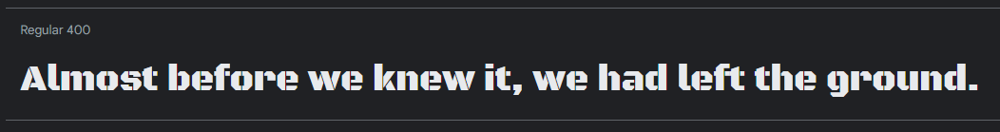
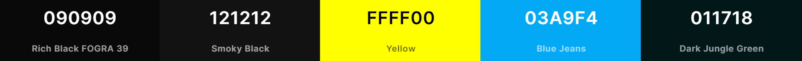

<h1 align="center"> 
	<a href="https://JayantGoel001.github.io/">JayantGoel001.github.io</a> - v1.0
    <p align="center">
      
      
      
      
      
      
    </p>
</h1>
<div align="center">
	<a href="https://github.com/JayantGoel001/JayantGoel001.github.io">
		
	</a>
	<h3 align="center">Jayant Goel (JayantGoel001)'s Personal Portfolio</h3>
	<p align="center">
		This is the source code for my Personal Portfolio.
		<br/>
		<a href="https://github.com/JayantGoel001/JayantGoel001.github.io"><strong>Explore the docs »</strong></a>
		<br/>
		<br/>
		<a href="https://jayantgoel001.github.io/">View Demo</a>
		·
		<a href="https://github.com/JayantGoel001/JayantGoel001.github.io/issues/new?assignees=JayantGoel001&labels=bug&template=bug_report.yml&title=%5BBUG%5D%3A+">Report Bug</a>
		·
		<a href="https://github.com/JayantGoel001/JayantGoel001.github.io/issues/new?assignees=&labels=enhancement&template=feature_request.yml&title=%5BFEAT%5D%3A+">Request Feature</a>
		<br/>
		<br/>
		 • 
		 • 
		 •
		 •
         •
		
	</p>
</div>

<br/>

<p align="center">
  <a href="https://JayantGoel001.github.io/" target="_blank">
    
  </a>
</p>


## Table of Contents :scroll:

- [Design](#design-art)
    - [Fonts](#fonts)
    - [Color Scheme](#color-scheme)
    - [Icon](#icon)
- [Built With](#built-with-package)
- [How to Run Locally?](#how-to-run-locally-dart)
- [Sections](#sections-bookmark)
- [Folder Structure](#folder-structure-open_file_folder)
<<<<<<< HEAD
=======
- [Search engine optimization(SEO)](#search-engine-optimizationseo-spider)
- [PageSpeed Insights](#pagespeed-insights)
>>>>>>> 2be03a7 (Initial Commit)
- [Creator / Maintainer](#creator--maintainer-man_technologist)
- [Contributing](#-contributing)
- [Contributors](#contributors-)
- [License](#-license)


## Design :art:

### Fonts

[Black Ops One](https://fonts.google.com/specimen/Black+Ops+One) - Text Style



### Color Scheme

#### Main Screen

- **Gunmetal** - Primary theme color
- **Yellow Orange Color Wheel** - Secondary theme color
- **Eerie Black** - Dark Text Color
- **Sonic Silver** - Muted Text Color
- **White** - Text Color
- **Cultured** - Light Text Color & Light Background Color
- **Dutch White** - Waifu Tips Background Color

<a href="https://coolors.co/242a35-ff9800-212529-6c757d-ffffff-f8f9fa-ecd9bc">
  
</a>

<br/>
<br/>

#### Splash Screen & 404 Page

- **Rich Black FOGRA 39** - Background Color of Splash Screen
- **Smoky Black** - Path of Splash Circle of Splash Screen
- **Yellow** - Outer Splash Circle color
- **Blue Jeans** - Inner Splash Circle color
- **Dark Jungle Green** - 404 Text Color

<a href="https://coolors.co/090909-121212-ffff00-03a9f4-011718">
  
</a>

### Icon

This is the icon of me in [JayantGoel001.github.io](https://JayantGoel001.github.io)


Insert the following code in the `<head>` section of your pages to support favicons on all browsers and platforms.

```html
<meta name="theme-color" content="#242a35">
<link rel="manifest" href="manifest.webmanifest">
<link rel="icon" type="image/png" sizes="16x16" href="favicon-16x16.png">
<link rel="icon" type="image/png" sizes="32x32" href="favicon-32x32.png">
<link rel="apple-touch-icon" sizes="180x180" href="apple-touch-icon.png">
<link rel="mask-icon" href="assets/images/safari-pinned-tab.svg" color="#242a35">
<meta name="msapplication-TileColor" content="#242a35">
<meta name="msapplication-TileImage" content="assets/images/mstile-70x70.png">
<meta name="msapplication-TileImage" content="assets/images/mstile-144x144.png">
<meta name="msapplication-TileImage" content="assets/images/mstile-150x150.png">
<meta name="msapplication-TileImage" content="assets/images/mstile-310x150.png">
<meta name="msapplication-TileImage" content="assets/images/mstile-310x310.png">
```

Results :- [100%](https://realfavicongenerator.net/favicon_checker?protocol=https&site=jayantgoel001.github.io)

These are the Font Awesome Icons used in [JayantGoel001.github.io](https://JayantGoel001.github.io)


## Built With :package:

- 💙 [HTML5](https://www.w3schools.com/html/)
- 💜 [CSS3](https://www.w3schools.com/css/)
- 💙 [JavaScript](https://www.w3schools.com/js/DEFAULT.asp)
- 💜 [Bootstrap](https://getbootstrap.com/)
- 💙 [JQuery](https://jquery.com/)
- 💜 [Google Font](https://fonts.google.com/) for the fonts
- 💙 [FontAwesome](https://fontawesome.com/) for the icons
- 💜 [GitHub Pages](https://pages.github.com/) for hosting

<<<<<<< HEAD
=======

## How to run locally? :dart:

- Clone the repository :
  - With HTTPS:
    ```bash
    git clone https://github.com/JayantGoel001/JayantGoel001.github.io.git
    ```
  - With SSH:
    ```bash
    git@github.com:JayantGoel001/JayantGoel001.github.io.git
    ```

- Navigate to working Directory.

  ```bash
  cd JayantGoel001.github.io
  ```

- Fire up a development server:

  ```bash
  ./index.html
  ```

- Create a new branch:

  ```bash
  git checkout -b "<NAME-OF-THE-BRANCH>"
  ```

- Add, Commit & Push the local changes to remote repository:

  ```bash
  git add .
  git commit -m "<COMMIT-MESSAGE>"
  git push origin <NAME-OF-THE-BRANCH>
  ```


## Sections :bookmark:

- Home
- About
  - About
  - Skill
  - Education
- Portfolio
- Training
- Achievement
- Contact


## Folder Structure :open_file_folder:

```bash

|   .all-contributorsrc
|   .gitignore
|   404.html
|   apple-touch-icon.png
|   browserconfig.xml
|   favicon-16x16.png
|   favicon-32x32.png
|   favicon-48x48.png
|   favicon.ico
|   index.html
|   LICENSE
|   manifest.json
|   README.md
|   robots.txt
|   service-worker.js
|   sitemap_index.xml
|   
+---assets
|       girl-tips.json
|       particles.json
|       
+---css
|       404.min.css
|       animate.min.css
|       fonts.min.css
|       girl.min.css
|       styles.min.css
|       
+---images
|       404.webp
|       about-bg-sm.svg
|       about-bg.svg
|       aiicb.webp
|       aimg.webp
|       asm.webp
|       bgimg.webp
|       data-science.webp
|       ecs.webp
|       footer-cloud.svg
|       frame-desktop.webp
|       frame-mobile.webp
|       gist.webp
|       HackerRank.webp
|       hacktoberfest2020.webp
|       monkey.webp
|       moon-dark.svg
|       moon.svg
|       mstile-144x144.png
|       mstile-150x150.png
|       mstile-310x150.png
|       mstile-310x310.png
|       mstile-70x70.png
|       og-image.jpg
|       Profile-pic-192x192.png
|       Profile-pic-384x384.png
|       Profile-pic-512x512.png
|       Profile-pic.webp
|       quote-img.webp
|       safari-pinned-tab.svg
|       sda.webp
|       us.webp
|       
+---js
|       404.min.js
|       app.js
|       app.min.js
|       bootstrap.bundle.min.js
|       dark-light-theme.min.js
|       girl-tips.min.js
|       girl.min.js
|       jquery-3.5.1.min.js
|       jquery.easing.min.js
|       live2d.min.js
|       particles.min.js
|       scrollspy.min.js
|       typed.init.js
|       typed.min.js
|       vanilla-tilt.min.js
|       wow.min.js
|       
\---screenshots
        color-loader-404.png
        color-main.png
        font-awesome-icon.png
        font.png
        icon.png
        screenshot.gif        
```

<<<<<<< HEAD
>>>>>>> 3cec5ff (Initial Commit)
=======

## Search engine optimization(SEO) :spider:

Search engine optimization (SEO) is the process of improving the quality and quantity of website traffic to a website or a web page from search engines.
Add the below code snippet to `index.html` with your site info. This step is not mandatory.

```html
<meta itemprop="name" content="--- YOUR TITLE ---">
<meta itemprop="description" content="--- SITE DESCRIPTION ---">
<meta itemprop="url" content="--- YOUR SITE URL ---"/>
<meta itemprop="image" content="--- YOUR IMAGE ---">
<link rel="image_src" href="--- YOUR IMAGE ---">

<meta name="author" content="--- YOUR NAME ---">
<meta name="description" content="--- SITE DESCRIPTION ---">
<meta name="keywords" content="--- SITE KEYWORDS ---">

<meta property="og:image" content="--- YOUR IMAGE ---">
<meta property="og:image:width" content="--- YOUR IMAGE WIDTH ---">
<meta property="og:image:height" content="--- YOUR IMAGE HEIGHT ---">
<meta property="og:image:alt" content="--- YOUR TITLE ---">
<meta property="og:title" content="--- YOUR TITLE ---">
<meta property="og:description" content="--- SITE DESCRIPTION ---">
<meta property="og:url" content="--- YOUR SITE URL ---">
<meta property="og:type" content="website">

<meta name="twitter:title" content="--- YOUR TITLE ---">
<meta name="twitter:description" content="--- SITE DESCRIPTION ---">
<meta name="twitter:site" content="@--- YOUR USERNAME ---">
<meta name="twitter:creator" content="@--- YOUR USERNAME ---">
<meta name="twitter:image:src" content="--- YOUR IMAGE ---">
<meta name="twitter:image" content="--- YOUR IMAGE ---">
<meta name="twitter:card" content="summary_large_image">
```

>>>>>>> 070001d (Update README.md)

## PageSpeed Insights

PageSpeed Insights (PSI) reports on the performance of a page on both mobile and desktop devices, and provides suggestions on how that page may be improved.

- **Desktop**

  [](https://googlechrome.github.io/lighthouse/viewer/?psiurl=https%3A%2F%2Fjayantgoel001.github.io%2F&strategy=desktop&category=performance&category=accessibility&category=best-practices&category=seo&category=pwa)

- **Mobile**

  [](https://googlechrome.github.io/lighthouse/viewer/?psiurl=https%3A%2F%2Fjayantgoel001.github.io%2F&strategy=mobile&category=performance&category=accessibility&category=best-practices&category=seo&category=pwa)


## Creator / Maintainer :man_technologist:

👤 Jayant Goel ([JayantGoel001](https://github.com/JayantGoel001))

If you have any questions, comments, or concerns, feel free to contact me below.

<p align="left">
	<a href="https://www.linkedin.com/in/JayantGoel001"> 
    	
  	</a>
	<a href="mailto:jgoel92@gmail.com"> 
		
	</a>
	<a href="https://www.twitter.com/JayantGoel001"> 
    	
  	</a>
</p>

This project was created for educational purposes and for personal use. Feel free to take inspiration.

If you like my content or find this code useful, give it a ⭐.


## 🤝 Contributing

Contributions, Issues and Feature requests are Welcome!

Feel free to check the [Issues page](https://github.com/JayantGoel001/JayantGoel001.github.io/issues/).


## Contributors ✨

<!-- ALL-CONTRIBUTORS-BADGE:START - Do not remove or modify this section -->
[](#contributors-)
<!-- ALL-CONTRIBUTORS-BADGE:END -->

Thanks goes to these wonderful people ([emoji key](https://allcontributors.org/docs/en/emoji-key)):

<!-- ALL-CONTRIBUTORS-LIST:START - Do not remove or modify this section -->
<!-- prettier-ignore-start -->
<!-- markdownlint-disable -->
<table>
  <tr>
    <td align="center"><a href="http://JayantGoel001.github.io"><br /><sub><b>Jayant Goel</b></sub></a><br /><a href="https://github.com/JayantGoel001/JayantGoel001.github.io/commits?author=JayantGoel001" title="Code">💻</a> <a href="#ideas-JayantGoel001" title="Ideas, Planning, & Feedback">🤔</a> <a href="https://github.com/JayantGoel001/JayantGoel001.github.io/commits?author=JayantGoel001" title="Tests">⚠️</a> <a href="#maintenance-JayantGoel001" title="Maintenance">🚧</a> <a href="https://github.com/JayantGoel001/JayantGoel001.github.io/commits?author=JayantGoel001" title="Documentation">📖</a> <a href="#design-JayantGoel001" title="Design">🎨</a> <a href="https://github.com/JayantGoel001/JayantGoel001.github.io/pulls?q=is%3Apr+reviewed-by%3AJayantGoel001" title="Reviewed Pull Requests">👀</a> <a href="#content-JayantGoel001" title="Content">🖋</a></td>
    <td align="center"><a href="https://www.linkedin.com/in/anchal-p-908643b6/"><br /><sub><b>Anchal Pandey</b></sub></a><br /><a href="https://github.com/JayantGoel001/JayantGoel001.github.io/issues?q=author%3Acode1511" title="Bug reports">🐛</a></td>
    <td align="center"><a href="https://emmadawson.dev"><br /><sub><b>Emma Dawson</b></sub></a><br /><a href="https://github.com/JayantGoel001/JayantGoel001.github.io/issues?q=author%3Aemmalearnscode" title="Bug reports">🐛</a></td>
  </tr>
</table>

<!-- markdownlint-restore -->
<!-- prettier-ignore-end -->

<!-- ALL-CONTRIBUTORS-LIST:END -->

This project follows the [all-contributors](https://github.com/all-contributors/all-contributors) specification. Contributions of any kind welcome!


## 📝 License

This project is [MIT](https://opensource.org/licenses/MIT) licensed.<br/>
Copyright &copy; 2021 Jayant Goel. All rights reserved. 
