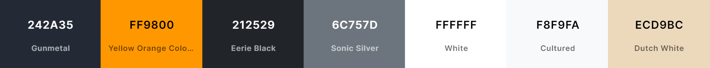

# [JayantGoel001.github.io](https://JayantGoel001.github.io/) - v2.0

This is the source code for my personal portfolio.

    
    
    
    
    
    
    
    
    

  

## Table of Contents

- [Design](#design)
	- [Fonts](#fonts)
	- [Color Scheme](#color-scheme)
	- [Icon](#icon)
- [Built With](#built-with)
- [Creator / Maintainer](#creator--maintainer)
- [Contributors](#contributors-)
- [License](#license)

---

## Design

### Fonts

[Black Ops One](https://fonts.google.com/specimen/Black+Ops+One) - Text Style

### Color Scheme

#### Main Screen

- **Gunmetal** - Primary theme color
- **Yellow Orange Color Wheel** - Secondary theme color
- **Eerie Black** - Dark Text Color
- **Sonic Silver** - Muted Text Color
- **White** - Text Color
- **Cultured** - Light Text Color & Light Background Color
- **Dutch White** - Waifu Tips Background Color

 
 

#### Splash Screen & 404 Page

- **Rich Black FOGRA 39** - Background Color of Splash Screen
- **Smoky Black** - Path of Splash Circle of Splash Screen
- **Yellow** - Outer Splash Circle color
- **Blue Jeans** - Inner Splash Circle color
- **Dark Jungle Green** - 404 Text Color

### Icon

This is the icon of me in [JayantGoel001.github.io](https://JayantGoel001.github.io)

These are the Font Awesome Icons used in [JayantGoel001.github.io](https://JayantGoel001.github.io)

---

## Built With

- 💙 [HTML5](https://www.w3schools.com/html/)
- 💜 [CSS3](https://www.w3schools.com/css/)
- 💙 [JavaScript](https://www.w3schools.com/js/DEFAULT.asp)
- 💜 [TypeScript](https://www.typescriptlang.org/)
- 💙 [Angular](https://angular.io/)
- 💜 [NodeJS](https://nodejs.org/)
- 💙 [Bootstrap](https://getbootstrap.com/)
- 💜 [Google Font](https://fonts.google.com/) for the fonts
- 💙 [FontAwesome](https://fontawesome.com/) for the icons
- 💜 [GitHub Pages](https://pages.github.com/) for hosting

---

## Creator / Maintainer

Jayant Goel ([JayantGoel001](https://github.com/JayantGoel001))

If you have any questions, comments, or concerns, feel free to contact me below.

  

This project was created for educational purposes and for personal use. Feel free to take inspiration.

If you like my content or find this code useful, give it a ⭐

---

## Contributors ✨

<!-- ALL-CONTRIBUTORS-BADGE:START - Do not remove or modify this section -->

<!-- ALL-CONTRIBUTORS-BADGE:END -->

Thanks goes to these wonderful people ([emoji key](https://allcontributors.org/docs/en/emoji-key)):

<!-- ALL-CONTRIBUTORS-LIST:START - Do not remove or modify this section -->
<!-- prettier-ignore-start -->
<!-- markdownlint-disable -->
<table>
  <tr>
    <td align="center"><a href="https://JayantGoel001.github.io"> <b>Jayant Goel</b></a> <a href="https://github.com/JayantGoel001/JayantGoel001.github.io/commits?author=JayantGoel001" title="Code">💻</a> <a href="#ideas-JayantGoel001" title="Ideas, Planning, & Feedback">🤔</a> <a href="https://github.com/JayantGoel001/JayantGoel001.github.io/commits?author=JayantGoel001" title="Tests">⚠️</a> <a href="#maintenance-JayantGoel001" title="Maintenance">🚧</a> <a href="https://github.com/JayantGoel001/JayantGoel001.github.io/commits?author=JayantGoel001" title="Documentation">📖</a> <a href="#design-JayantGoel001" title="Design">🎨</a> <a href="https://github.com/JayantGoel001/JayantGoel001.github.io/pulls?q=is%3Apr+reviewed-by%3AJayantGoel001" title="Reviewed Pull Requests">👀</a> <a href="#content-JayantGoel001" title="Content">🖋</a></td>
    <td align="center"><a href="https://www.linkedin.com/in/anchal-p-908643b6/"> <b>Anchal Pandey</b></a> <a href="https://github.com/JayantGoel001/JayantGoel001.github.io/issues?q=author%3Acode1511" title="Bug reports">🐛</a></td>
  </tr>
</table>

<!-- markdownlint-restore -->
<!-- prettier-ignore-end -->

<!-- ALL-CONTRIBUTORS-LIST:END -->

This project follows the [all-contributors](https://github.com/all-contributors/all-contributors) specification. Contributions of any kind welcome!

---

## License

Copyright &copy; 2021 Jayant Goel. All rights reserved.
